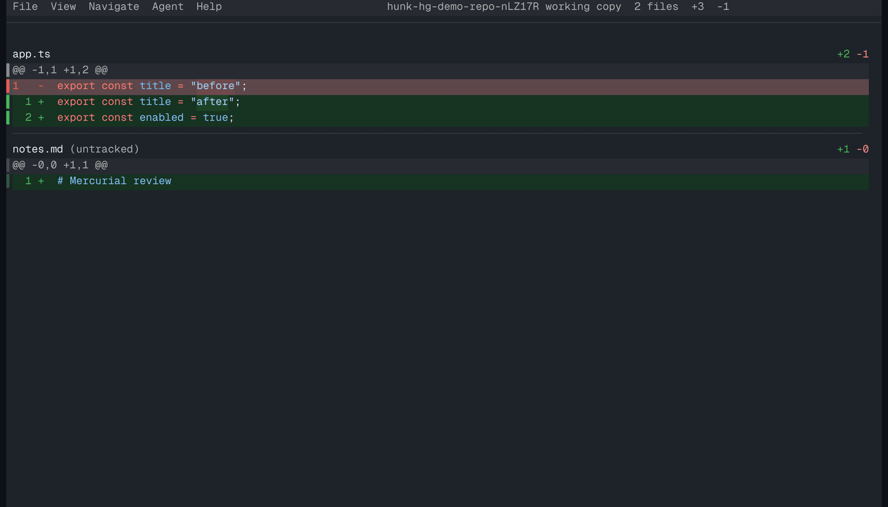

# Hunk Hg

[Hunk](https://hunk.dev) extension that adds [Mercurial](https://www.mercurial-scm.org/) (`hg`) support.



## Install

Hunk 0.19 or newer installs extensions directly from Git:

```sh
hunk extension install modem-dev/hunk-hg
```

New Hunk sessions detect Mercurial repositories automatically. The extension requires `hg` on your `PATH`.

## Use

Run Hunk inside any Mercurial checkout:

```sh
hunk diff                    # working-copy changes and unknown files
hunk diff --exclude-untracked
hunk diff REV                # REV versus the working copy
hunk diff A..B               # revision A versus revision B
hunk show REV                # one changeset versus its first parent
hunk diff -- path/to/file    # filter by path
```

`A..B` is translated to Mercurial's `hg diff --from A --to B` syntax. Hunk's `--staged` flag is unavailable because Mercurial has no staging area. `hunk stash show` is also unavailable; Mercurial shelves do not have Git-stash semantics.

Mercurial merge diffs retain Mercurial's default first-parent behavior. Use Mercurial's own `diff.merge` configuration when you need its conflict-region behavior.

## Develop

```sh
bun install
bun run check
hunk diff --extension /path/to/hunk-hg
```

The test suite runs real Mercurial integration tests when `hg` is installed. CI installs Mercurial before validation.

## Release

Tag a release and pin it when installing:

```sh
hunk extension install modem-dev/hunk-hg@v0.1.0
```

See [Hunk's extension guide](https://hunk.dev/docs/extend/extensions/) for the extension trust model and API.

## License

[MIT](LICENSE)
